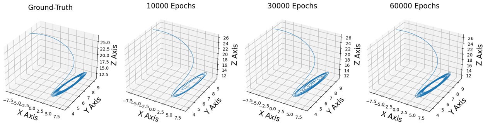

# Physics-informed neural networks
This repository provides a Tensorflow 2 implementaion of physics-informed neural networks (PINNs) [Raissi et al.](https://arxiv.org/abs/1711.10561) applied to the inverse problem of parameter identification in the Lorenz system. This reproduces example 4.3 of the paper: [DeepXDE: A deep learning library for solving differential equations](https://arxiv.org/abs/1907.04502). The figure below shows evolution of the learned solution over the course of the training as compared to the ground-truth.



The parameter identification yielded:

Estimated parameters: c1 = 10.00, c2 = 15.01, c3 = 2.66

True parameters: c1 = 10.00, c2 = 15.00, c3 = 2.67

# Environment setup
The code is implemented in Python 3.7 using the tensorflow2 library. Our anaconda environment can be replicated using the provided requirements.txt
```  
$ conda create --name pinn --file requirements.txt
$ conda activate pinn
```

If you find this code helpful in your research please cite the following paper:
```
@article{vanHerten2020pinn,
  title={Physics-informed neural networks for myocardial perfusion MRI quantification.},
  author={van Herten, Rudolf LM and Chiribiri, Amedeo, and Breeuwer, Marcel and Veta, Mitko and Scannell, Cian M},
  journal={arXiv preprint arXiv:2011.12844},
  year={2020}
}
```
